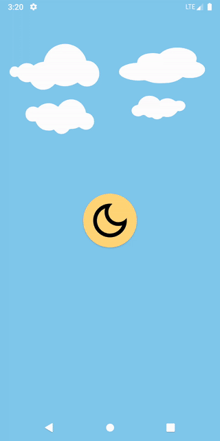

# Night Mode Enabler

## Description
A simple app which allows for toggling night mode on older Android devices.  
Older android devices don't have the ability to set night mode exposed in the settings.  

This app also adds a quick settings tile to toggle night mode from anywhere. This is convenient for developers testing on older devices who want to check how their app handles night mode.  

The app is available on [Google Play](https://play.google.com/store/apps/details?id=com.damien.nightmodeenabler).

Makes use of Data Binding and Material Theming.
Checkout the [compose branch](https://github.com/idomo1/night-mode-enabler/tree/compose) to see this app rewritten using Jetpack Compose.

## Dependencies
* AndroidX
* Material components
* No DI framework